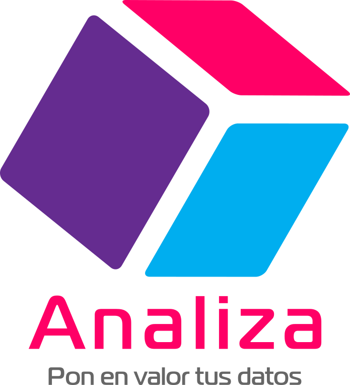
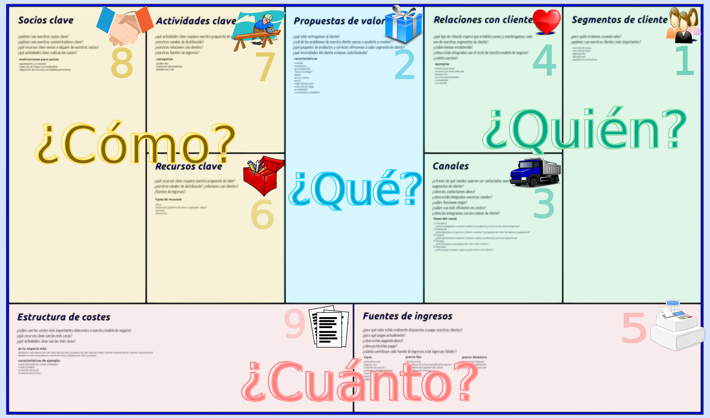

[www.analiza.org]()

---

## Presentación

**Analiza** es una cooperativa de trabajo asociado especializada en la extracción de conocimiento por medio de la recolección, análisis e interpretación de datos.

> ¡¡¡Si tienes datos, tienes un tesoro!!!  
> Nosotras te ayudamos a extraerlo.  
> 

---

## Servicios

### Análisis de datos

- Diseño y planificación de experimentos
- Diseño de formularios de recogida de datos
- Diseño de bases de datos
- Visualización de datos
- Análisis estadístico (descriptivo e inferencial)
- Extracción de patrones, reglas y tendencias
- Modelos predictivos
- Minería de datos (Big data)

----

### Formación

- Estadística Aplicada
- Inteligencia Artificial
- Bases de datos (SQL, Mongo, Json)
- Aplicaciones de análisis de datos (R, SPSS, Python, Weka, Spark, Knime)

---

## CANVAS

----

### Propuesta de valor

<table class='colortable' style='border-collapse: collapse; margin-top: 1em; margin-bottom: 1em;' >
<col width="500">
<col width="500">
<thead>
<tr>
<th style='border-bottom: 1px solid grey; border-top: 2px solid grey; text-align: center;'>Necesidades</th>
<th style='border-bottom: 1px solid grey; border-top: 2px solid grey; text-align: center;'>Soluciones</th>
</tr>
</thead>
<tbody>
<tr>
<td style='text-align: left;'>
Mejorar la calidad de los datos
</td>
<td style='text-align: left;'>
Diseño y depuración de bases de datos
</td>
</tr>
<tr>
<td style='text-align: left;'>
Desconocimiento del valor oculto en los datos
</td>
<td style='text-align: left;'>
Presentaciones y casos de ejemplo
</td>
</tr>
<tr>
<td style='text-align: left;'>
Conocer mejor a los clientes  
Diversificar y focalizar la oferta
</td>
<td style='text-align: left;'>
Identificación de perfiles y redes
</td>
</tr>
<tr>
<td style='border-bottom: 2px solid grey; text-align: left;'>
Conocer los sentimientos hacia la empresa
</td>
<td style='border-bottom: 2px solid grey; text-align: left;'>
Análisis de redes sociales, blog, comentarios y valoraciones
</td>
</tr>
<tr>
<td style='text-align: left;'>
Reducir costes
</td>
<td style='text-align: left;'>
Análisis y optimización de procesos
</td>
</tr>
<tr>
<td style='border-bottom: 2px solid grey; text-align: left;'>
Mejora de la toma de decisiones
</td>
<td style='border-bottom: 2px solid grey; text-align: left;'>
Identificación y minimización de riesgos
</td>
</tr>
<tr>
<td style='border-bottom: 2px solid grey; text-align: left;'>
Pocos conocimientos de Estadística
</td>
<td style='border-bottom: 2px solid grey; text-align: left;'>
Formación adaptada
</td>
</tr>
</tbody>
</table>

----

#### Ventaja diferencial

- Amplia experiencia
- Innovación continua
- Combinación del Análisis de datos con la formación para la interpretación de resultados.
- Uso de software libre
- Precios asequibles para la pequeña y mediana empresa (especialmente de la Economía Social)

----

### Segmentos de clientes

<table class='colortable' style='border-collapse: collapse; margin-top: 1em; margin-bottom: 1em;' >
<col width="20">
<col width="500">
<col width="500">
<thead>
<tr>
<th style='border-bottom: 1px solid grey; border-top: 2px solid grey; text-align: center;'></th>
<th style='border-bottom: 1px solid grey; border-top: 2px solid grey; text-align: center;'>Grandes empresas</th>
<th style='border-bottom: 1px solid grey; border-top: 2px solid grey; text-align: center;'>Pequeña y mediana empresa</th>
</tr>
</thead>
<tbody>
<tr>
<td style='text-align: right;' class="rotate">
Clientes
</td>
<td style='text-align: left;'>
Hospitales  
Empresas biotecnológicas  
Banca  
Energéticas  
Telecomunicaciones  
Comercio electrónico  
Administraciones públicas  
</td>
<td style='text-align: left;'>
Economía social ???  
Cooperativas  
Comercio electrónico
</td>
</tr>
<tr>
<td style='border-bottom: 2px solid grey; text-align: right;' class="rotate">
Servicios
</td> 
<td style='border-bottom: 2px solid grey; text-align: left;'>
Análisis de datos  
Extracción de conocimiento  
Formación Estadística e Inteligencia Artificial  
Formación aplicaciones
</td>
<td style='border-bottom: 2px solid grey; text-align: left;'>
Asesoría recolección y explotación de datos  
Formación bases de datos</td>
</tr>
</tbody>
</table>

----

### Relaciones con clientes (Estrategias de comunicación)

- Sitio web
    - Formulario de contacto
    - Blog
    - Foros de clientes
    - Preguntas frecuentes (FAQs)
    - Encuestas de satisfacción
- Correo electrónico
- Teléfono
- Redes sociales
- Campañas de publicidad web y redes sociales

----

### Canales de distribución

- Sitio Web
- Herramientas de trabajo colaborativo

----

### Actividades clave

- Captación de nuevos clientes
- **Mantenimiento de la web**
- Actividad en las redes sociales
- **Comunicación e interacción con los clientes**
- **Preparación e impartición de cursos de formación**
- **Análisis de datos**

----

### Recursos clave

- Creación de la marca Analiza
- Alojamiento de la web en un servidor
- Teléfonos móviles
- 3 ordenadores
- Acceso a internet
- Correo electrónico
- Software

----

### Alianzas

Prescriptores:

- Antiguos clientes
- Empresas de la economía social (como Tangente)
- Empresas de elaboración de sondeos y encuestas

----

### Entradas de recursos económicos

#### Financiación

- Financiación propia

#### Ingresos

- Tarificación por servicios
    - Precio por proyecto para grandes empresas
    - Precio por horas para las pequeñas y medianas (20€ hora)

----

### Salidas de recursos económicos

#### Inversión inicial

- Capital para la constitución de la cooperativa (1800€)
- Campaña de publicidad en web y redes sociales (200€ mensuales x 3 meses)

#### Gastos

- Alquiler del servidor para la web (50€ mensuales)
- Cotización a la Seguridad Social (377€ mensuales)
- Impuestos (?)

---

## Formula jurídica empresarial

- Cooperativa de trabajo asociado de 3 socios con igual aportación de capital
- Régimen General de la Seguridad Social